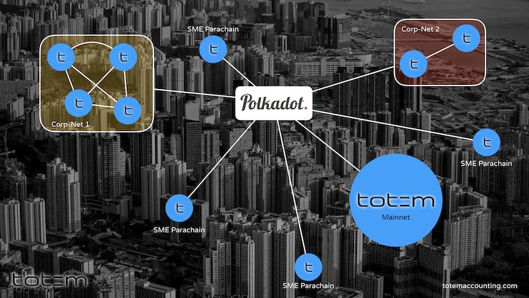
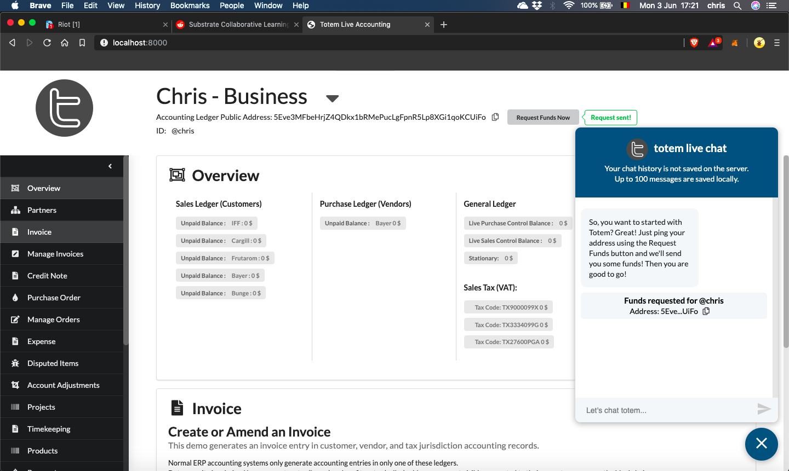

# Welcome to the Totem Project
**Totem is building a global, interconnected, realtime accounting system for everyone.** 

> We believe that seperate accounting systems do not make sense in a connected world. We asked one question: If you were to reinvent accounting today, what would it look like? 

Inside this repo you will find a very first proof of concept - it is by no means a finished product, or ready for market, but it demonstrates a new world of  accounting capabilities that, as far as we know, has not yet been explored in the blockchain space.

## Acheivements so far!

Off the back of this first demo, we have attracted attention of a large independent accounting firm who have agreed to guide and advise. Furthermore, we have enrolled our first Data Sponsor. We have received a full accounting set of recent data and agreement to allow us to remodel how Totem could work for them.

Combining both these partners will allow us to move forward with clear goals, building specific Use Cases that we believe will give Totem a headstart against the inevitable competiton.

## A word of caution: 
All coding seen in here has been done for _expediency_ and to arrive at a demo proof-of-concept as quickly as possible. At the same time it has enabled us to make value judgements about the capabilities and suitability of Substrate as a framework.  

* Nobody should consider any of this code as final. 

All we ask is that nobody judges because this is very early days. 

## Latest Build State

## Contacts

### Founder, Development Lead

Chris D'Costa  

### Co-Founder

Miro Svetlic  

### Co-Founder

Toufiqur Chowdhury  

## Website
[Totem Live Accounting](https://totemaccounting.com)